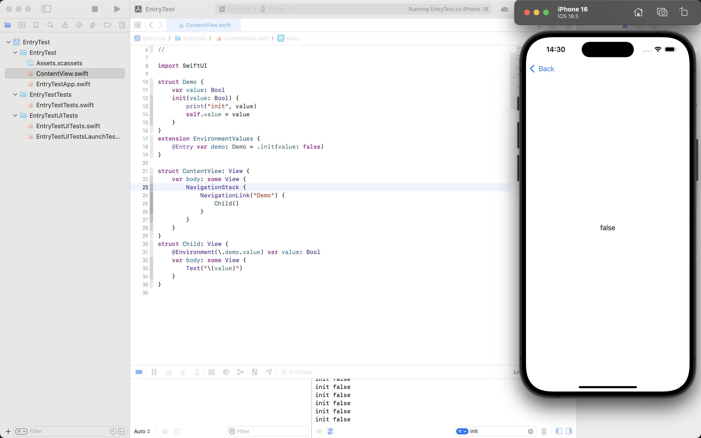
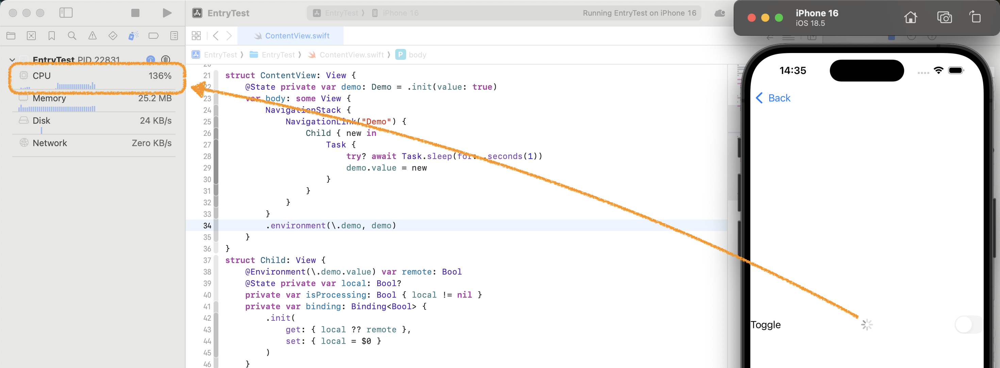

# @Environment(\\.keyPath)をフル活用したアーキテクチャ作り

<div class="author-info">
  
  <div class="float-right">
    星野恵瑠<br />
    Twitter: @lovee<br />
    mixi2: @lovee<br />
    GitHub: @el-hoshino
  </div>
</div>

## はじめに

去年のiOSDCでは、私は「@Environment(\\.keyPath)実践入門」というパンフレット記事を執筆しました。その記事では、@Environment(\.keyPath)の仕組み、基礎的な使い方、そしてKeyPath連結などのちょっとしたテクニックを紹介しました。文字サイズとかを工夫してなんとか8ページに収めたほどのボリュームでしたが、おかげさまでたくさんの好評をいただきました。

しかし、@Environment(\\.keyPath)はまだまだ奥が深く、実際のアプリケーション開発ではもっとたくさんの使い方や裏技が存在します。そこで、今回はその続編として、@Environment(\\.keyPath)の更なる高度なテクニックから、それらをフル活用したアーキテクチャ作りについて掘り下げていきたいと思います。

<div class="float-right">
    
</div>

今回の記事で紹介するコードはすべてXcode 16.4にて検証しております。また、内容は全て前回の記事を読まれた前提としています。まだ読んでいない方は、まず下記のリンクもしくは右のQRコードから、前回の記事を読んでからこの記事を読むことをお勧めします。

<https://qiita.com/lovee/items/0893d3ed7813e66d8188>

## @Environment(\\.keyPath)の更なる高度なテクニック

それでは、早速@Environment(\\.keyPath)の更なる高度なテクニックを紹介していきます。

### 既存の環境変数を拡張して使う

最近のアプリ、特にそれなりの規模がある会社の場合は、アプリ内で使う色などをきちんとしたデザインシステムで定義していることが多いです。そして今は色の場合、カラースキーム、すなわちライトモードがダークモードか、を考慮する必要があります。そのため、このデザインシステムの利用にあたって、このようにViewの実装を考えていませんか？

```swift
// ColorSystem.swift
struct ColorSystem {
    static func primaryTextColor(in colorScheme: ColorScheme) -> Color {
        switch colorScheme {
        // ...
        }
    }
    // ...
}
```

```swift
// ContentView
struct ContentView: View {
    @Environment(\.colorScheme) var colorScheme: ColorScheme

    var body: some View {
        Text("Demo")
            .foregroundStyle(
                ColorSystem.primaryTextColor(in: colorScheme)
            )
    }
}
```

上記の実装では、`@Environment(\.colorScheme)`から現在のカラースキームを取得して、色情報を定義した`ColorSystem`に渡し、適切な色を選択してテキストに設定しています。もちろんこの実装でもなんの問題もないですが、やはり呼び出しが無駄に長いのが気になりますよね。

ところが、今回の`ColorSystem`は、既存の環境変数、すなわち`@Environment(\.colorScheme)`を使いたいだけで、別に状況に応じて違うインスタンスを入れたいわけではないです。このような場合は、実は`EnvironmentValues`に対してセッターを入れる必要もないので、ゲッターだけの`@Environment(\.keyPath)`も定義できます。

```swift
// ColorSystem.swift
struct ColorSystem {
    var colorScheme: ColorScheme

    var primaryText: Color {
        switch colorScheme {
        // ...
        }
    }
    // ...
}

extension EnvironmentValues {
    // ここではセッターが必要ないので、`@Entry`は使う必要がありません
    var colorSystem: ColorSystem {
        // `colorScheme`はEnvironmentValuesに既に存在しているので、そのまま使えます
        .init(colorScheme: colorScheme)
    }
}
```

そしたら、`ContentView`の実装は次のように書き換えられます。

```diff
// ContentView
struct ContentView: View {
-    @Environment(\.colorScheme) var colorScheme: ColorScheme
+    @Environment(\.colorSystem) var color: ColorSystem

    var body: some View {
        Text("Demo")
-            .foregroundStyle(
-                ColorSystem.primaryTextColor(in: colorScheme)
-            )
+            .foregroundStyle(color.primaryText)
    }
}
```

この実装では、`@Environment(\.colorScheme)`を直接参照していちいち`ColorSystem`に渡す必要がなくなり、何よりこれでAPIの設計も工夫しやすくなったため、無駄な「Color」や「System」を省略してもむしろよりわかりやすくなったので、冗長だったコードが一気に短くなり、よりスッキリして読みやすくなりました。

### WritableではないKeyPathを使っているビューのプレビューの仕方

ところが、上記のような`@Entry`を使わずに定義した環境変数や、前回の記事で紹介したKeyPathを連結した環境変数は、`EnvironmentValues`にセッターがないため、`\.environment(\.keyPath, value)`で値の注入ができません。本番環境では別にそもそもそういった環境変数に外部から値を注入しないから問題ないですが、Previewではさまざまなパターンを確認したいことが多いので、値注入したいこともありますよね。

<div class="float-right">
    
</div>

実はこの場合、直接`@Environment(\.keyPath)`を注入する方法もあります。例えば上のセクションの例で言うと、`ContentView(color: .init(<# KeyPath<EnvironmentValues, ColorSystem> #>))`のように書けば、`ContentView`生成時に直接`color`に対して`ColorSystem`を注入できます。具体的なやり方は残念ながら今回はページ数の都合でここでの紹介は割愛させてください。以前Qiitaで「@Environment(\\.keyPath.subPath)があるビューのプレビューの仕方」のタイトルで記事を書いて詳しく説明しましたので、ぜひ下のURLもしくは右のQRコードから読んでみてください：

<https://qiita.com/lovee/items/c84c8547278362925f84>

<!--
ところが、上記のような`@Entry`を使わずに定義した環境変数や、前回の記事で紹介したKeyPathを連結した環境変数は、`EnvironmentValues`にセッターがないため、`\.environment(\.keyPath, value)`で値の注入ができません。本番環境では別にそもそもそういった環境変数に外部から値を注入しないから問題ないですが、Previewではさまざまなパターンを確認したいことが多いので、値注入したいこともありますよね。ではどうすればいいでしょうか。

実は、皆さんご存知のように、`@Environment`というのはプロパティーラッパーで、例えば前回の記事で紹介した`@Environment(\.rect.midX) var midX: CGFloat`のような宣言の場合、実際のプロパティーは`var _midX: Environment<CGFloat>`です。なので、もし`Environment<CGFloat>`を直接イニシャライズ時に値を注入できれば、さまざまなパターンでプレビューを確認することがでるということです。幸い、`Environment<Value>`は本当にイニシャライザーが存在します、宣言はこんな感じです：

```swift
init(_ keyPath: KeyPath<EnvironmentValues, Value>)
```

このイニシャライザーの宣言を見れば、`KeyPath<EnvironmentValues, Value>`の値を引数に渡せば、`Environment<Value>`をイニシャライズできることがわかります。つまり、先ほどの`midX`の例であれば、次のように、`EnvironmentValues`を拡張してプレビューしたい値を作ってあげて、それを`KeyPath`としてプロパティーのイニシャライザーに渡してあげればいいです。

```swift
#if DEBUG
private extension EnvironmentValues {
    // プレビュー用のCGFloatの値を定義
    var cgFloat100: CGFloat {
        100
    }
}

#Preview {
    ContentView(midX: .init(\.cgFloat100))
}
#endif
```

こうすれば、`.environment(\.rect, CGRect(x: 0, y: 0, width: 100, height: 100))`のように頑張って`CGRect`を作って渡す必要がなくなり、`midX`の値を直接指定できます。もちろん`CGRect`のような単純なものなら別に作ってもそれほど面倒ではないですが、ちょっと構造が複雑だったり、上の章で紹介した`\.colorSystem`のようなそもそも連結したKeyPathを使っていない場合は、この方法でセッターがない環境変数に値を注入してプレビューすることができます。

ただし気をつけて欲しいのは、アップルの公式ドキュメントにも書いてあるとおり、このイニシャライザーは本来直接呼び出してはいけないものです。なのでこれはあくまでプレビュー用のテクニックだと考えてください。本番環境ではちゃんと然るべきところに`.environment(\.keyPath, value)`で値を注入してください。

<div class="column">

このようなプレビュー時に`Environment`を注入する手法に関して、以前この記事も書きましたので、もしよければぜひ読んでみてください：<br>
<https://qiita.com/lovee/items/c84c8547278362925f84>

</div>

<div class="column">

上の例では、`KeyPath`を渡すために、プレビュー用の値の定義は`cgFloat100`のような名前でComputed Propertyにしました。この場合はお察しの通り、該当プロパティーにさまざまな値をプレビューしたい場合、その数だけComputed Propertyを作る必要がありますが、執筆現在の2025年7月18日段階では、SE-0479にナンバリングされているプロポーザルが提出されレビュー中です。もしこのプロポーザルが通って実装されれば、メソッドでも`KeyPath`で表現できるようになるので、プレビュー用の値を入れるのがだいぶ楽にできます。

```swift
#if DEBUG
extension EnvironmentValues {
    // プレビュー用のメソッドを定義
    func preview<V>(_ value: V) -> V {
        value
    }
}

#Preview {
    // 実際のプレビューで使いたい値をその場で渡す
    ContentView(midX: .init(\.preview(100)))
    ContentView(midX: .init(\.preview(200)))
}
#endif
```

詳しくは、ぜひSE-0479のプロポーザルを読んでみてください。<br>
<https://github.com/swiftlang/swift-evolution/blob/main/proposals/0479-method-and-initializer-keypaths.md>

</div>
-->

## @Environment(\\.keyPath)の落とし穴

もちろん、こんな強力な@Environment(\\.keyPath)ですが、気をつけないと意外なところで想定外な動きをする落とし穴があります。ここからは、@Environment(\\.keyPath)を使う上での注意点や落とし穴について紹介します。

### `@Entry`のデフォルト値は何回も作られる

Xcode 16から、環境変数の宣言は`@Entry`で簡単にできるようになり、自力でいちいち頑張って`EnvironmentKey`を定義する必要がなくなりました。しかし、`@Entry`で宣言したデフォルト値は、実は保存されることなく、必要になるたびに新たに生成されてしまいます。

例えばこのように、イニシャライザーで生成時に何か出力をする型を作り、そして環境変数として定義しますが、値を注入せずにデフォルト値を利用させるコードを作ってみます。

```swift
struct Demo {
    var value: Bool
    init(value: Bool) {
        print("init", value); self.value = value
    }
}
extension EnvironmentValues {
    @Entry var demo: Demo = .init(value: false)
}

struct ContentView: View {
    var body: some View {
        NavigationStack {
            NavigationLink("Demo") {
                Child()
            }
        }
    }
}
struct Child: View {
    @Environment(\.demo.value) var value: Bool
    var body: some View {
        Text("\(value)")
    }
}
```

このようにすれば、`Child`の`@Environment(\.demo)`はデフォルト値を使います。そして何度か`Child`を表示してみると、コンソールが何度も`Demo`生成時の`init false`が出力されることがわかります。



ちなみに今のは敢えて値を注入しなかった結果ですが、実は注入したとしても、`@Entry`のデフォルト値が複数回生成されることあります。上記のコードを次のように改修してもう一度実行してみるとこのようになります：

```diff
struct ContentView: View {
+    @State private var demo: Demo = .init(value: true)
    var body: some View {
        NavigationStack {
@@ @@
        }
+        .environment(\.demo, demo)
    }
}
```


見ての通り、最初から`.environment`で値を注入したにもかかわらず、注入後にデフォルト値の`init false`が2回も出力されていることがわかります。この挙動になっている原因は、推測ですが環境変数の`demo`は`ContentView`の内容を描画時に初めて注入されましたが、その前に`App`の描画と`ContentView`自身の描画の段階では注入されていないので、2回デフォルト値を使うしかないからかと思います。ただこれではなぜデフォルト値の`init false`は注入値の`init true`の後に使われるか説明がつきません。どのみちひとまず言えるのは、生成コストの高いものを`@Entry`でデフォルト値を定義するときは気をつけたほうがいいです。最初からOptionalにしてデフォルト値を`nil`にするか、Optionalにしたくない場合は意外と昔ながらの`EnvironmentKey`を使って`statie let defaultValue`で定義する方法の方がいいかもしれません。

### 画面内の処理は@Environment(\\.keyPath)の変更を追えない

今時のアプリは、非同期処理が当たり前のようになってきています。時には、設計の都合上実際の処理は親が行い、自分自身はあくまで処理のトリガーしか持たないことも考えられます。この時、例えば実際の処理が終わるまでぐるぐるを表示したいと考えることもあるでしょう。この場合ぐるぐるの表示タイミングは、トリガー発火してから該当処理が変更する環境変数の更新までと考えられます。一つ上のセクションのコードの延長線で言うと、自身が`demo`の値を変更するトリガーを持ち、そしてその`demo`が変わったらぐるぐるを非表示にしたい、の仕様とします。この場合、下記のような実装を考える方もいるかもしれません：

```diff
            NavigationLink("Demo") {
-                Child()
+                Child { new in
+                    Task {
+                        try? await Task.sleep(for: .seconds(1))
+                        demo.value = new
+                    }
                }
```

```diff
struct Child: View {
-    @Environment(\.demo.value) var value: Bool
+    @Environment(\.demo.value) var remote: Bool
+    @State private var local: Bool?
+    private var isProcessing: Bool { local != nil }
+    private var binding: Binding<Bool> {
+        .init(
+            get: { local ?? remote },
+            set: { local = $0 },
+        )
+    }
+    var action: (Bool) -> Void
    var body: some View {
-        Text("\(value)")
+        Toggle("Toggle", isOn: binding)
+            .overlay {
+                ProgressView()
+                    .opacity(isProcessing ? 1 : 0)
+            }
+            .disabled(isProcessing)
+            .task(id: local) {
+                guard let new = local, new != remote else { return }
+                defer { local = nil }
+                action(new)
+                while local != remote {
+                    await Task.yield()
+                }
+            }
    }
}
```

この実装では、`Child`はトリガーとして`action`を持ちますが、`action`の内容は親の`ContentView`が定義しています。また、`Child`は自身が責務を持ってる内部で使う値と区別させるために、環境変数の`demo.remote`を`remote`として読み取り、内部で使うものを`local`として持ちます。そしてトグルの操作で`local`が書き込まれたらトリガーが発火し、1秒後に`ContentView`が`demo.value`、すなわち`Child`が持つ`remote`を変更します。`Child`はタスクの空きあれば常に`remote`の値を読み取り、変更されて`local`と同じ値になったら`local`を消してぐるぐるが非表示になる、と言う動きのはずです。ところが実際動かしてみたらわかりますが、ぐるぐるがいつまで経っても消えないし、CPU使用率も上がりっぱなしです。



なぜこうなるかというと、そもそも`@Environment`で取得されている値は、`.task`でキャプチャーされた時点で`.task`の処理内では定数になるから絶対に変わらないからです。なので`View`の処理の中で`@Environment`の変化を追跡しようとしてはいけません、追跡できずに無限ループになります。

今回の場合、一番適した方法はそもそも`action`を`(Bool) async -> Void`でもらって、`await action(new)`が終わったら`local = nil`にすればいいかと思います。ただ実際の案件によっては、例えばサーバのレスポンスと状態の更新が別々の処理でタイミングがズレることがあったりで素直な`async`処理にできないこともあるかもしれません。その場合は、処理内で`@Environment`を追跡するのではなく、`.task(id:)`もしくは`onChange(of:)`で監視するのがいいでしょう。

```diff
            .task(id: local) {
                guard let new = local, new != remote else { return }
-                defer { local = nil }
                action(new)
-                while local != remote {
-                    await Task.yield()
-                }
            }
+            .task(id: remote) {
+                local = nil
+            }
```

もちろんこちら可読性の観点では完璧とは言い難いし、そもそも`remote`の更新が本当に今の`local`の変更によるものか判別する手段すらない（サーバの設計がこうなった時点で完璧な解は無理な気もします）ですが、とりあえず覚えておいて欲しいのは、`@Environment`の変化を追跡したい時、Viewの処理内ではなく、`.task(id:)`もしくは`onChange(of:)`で行うことです。

### UIKitのModal遷移を行うと環境変数が引き継がれない

SwiftUIは残念ながら、UIKitほど画面遷移の自由度が高くありません。そのため、アプリの骨組みをUIKitで作り、各々の画面だけSwiftUIのViewで実装し、画面遷移が必要な時にUIKitの処理に任せる手法もよく使われています。しかしこの作り方をするときに気をつけて欲しいのは、UIKitのModal遷移メソッドを使うと、SwiftUIの環境変数が引き継がれないことです。

例えば今回の記事で何度も登場した`Demo`の環境変数をルートの`App`で定義し、`ContentView`をUIKitで作り、UIKitのModal遷移で`Child`を表示すると考えましょう。

```diff
@main
struct DemoApp: App {
+    @State private var demo: Demo = .init(value: true)
    var body: some Scene {
        WindowGroup {
            ContentView()
        }
+        .environment(\.demo, demo)
    }
}
```

```swift
struct ContentView: UIViewControllerRepresentable {
    func makeUIViewController(context: Context) -> some UIViewController {
        let vc = VC()
        let nc = UINavigationController(rootViewController: vc)
        return nc
    }
    func updateUIViewController(_ uiViewController: UIViewControllerType, context: Context) {}
}

final class VC: UIViewController {
    override func viewDidAppear(_ animated: Bool) {
        super.viewDidAppear(animated)
        let new = UIHostingController(rootView: Child())
        present(new, animated: true)
    }
}
```

上記のコードでは、`DemoApp`で一番大元の`WindowGroup`に対して`demo`環境変数を注入して、そして`ContentView`はSwiftUIのネイティブViewから、UIKitの`UINavigationController`を包んだ`UIViewControllerRepresentable`にして、その中身の`VC`が画面に表示されたらUIKitの`present`メソッドでSwiftUIの`Child`にModal遷移します。ところがページ数の都合でスクリーンショットを割愛しますが、いざこのアプリを実行してみるとわかると思います。`Child`の`@Environment(\.demo.value)`は注入された`true`ではなく、デフォルト値の`false`が表示されます。

ちなみに、上記の例はサンプルコードを最小限に収めるために起動直後に自動遷移させていますが、ボタンを置いて手動遷移させても同じ結果です。逆に同じModal遷移でもSwiftUIの`.sheet`などを使えば問題ないし、そしてUIKitでも`navigationController?.pushViewController`でPush遷移を行えば問題ないです。UIKitのModal遷移だけが問題です。これは仕様なのかバグなのかはわかりませんが、UIKitを使ったModal遷移を行うときは気をつけましょう。

## @Environment(\\.keyPath)をフル活用したアーキテクチャ作り

さて、前振りがだいぶかかりましたが、これでようやくこの記事の大本命である@Environment(\\.keyPath)を最大限に活用したアーキテクチャの紹介に入りたいと思います。まあアーキテクチャと言っても、そんなにたいそうなものではありません。と言うのも、私は過激派のMVVM不要論信者なので、一番シンプルなMV構成でプログラムを組むのが好きです。ただシンプルである故に、抽象化が非常に大事だと思います。そうでないと一つ一つの部品が担当することが膨らみ、依存の置き換えが難しくなりがちで、せっかくの使いやすいPreviewが作りにくくなります。

ところで、「抽象化」と聞くと、すぐ`protocol`を思い浮かぶではないかと思います。もちろん間違いではありませんが、実は`protocol`は抽象化のための手段の一つに過ぎません。極端の話、例えばボタンがあるとします。このボタンをタップすると、何か非同期な処理が行うとします。この場合、何の処理を行うかはわかりませんが、とりあえずこの処理を「型」で表現すれば、`() async -> Void`になりますね。実はこのように単純な型で表現すること自体も、立派な抽象化です。

ただSwiftの場合クロージャのままでは参照型の匿名関数になるので、いろいろ不都合がつきやすいです。そこでご紹介したいのはSwift 5.2から導入されたCallable Value機能です。これを使えば、参照型のクロージャを値型の`struct`に変換できちゃいます。変換の仕方は次のように、`struct`にクロージャを保存して、それを`func callAsFunction()`で呼び出すだけです：

```swift
struct ButtonAction {
    private var action: () async -> Void
    // これで外部から処理を注入できます
    init(_ action: @escaping () async -> Void) {
        self.action = action
    }
    func callAsFunction() async {
        await action()
    }
}

// そして使うときはこんな感じです
let buttonAction = ButtonAction {
    // ここで処理を入れてあげます
}
await buttonAction() // これで処理が呼び出されます
```

見慣れていない方もいるかも知れませんが、実はこの`buttonAction`のようなものは、我々がSwiftUI書くとき当たり前のように使っています。`@Environment(\.dismiss)`や`@Environment(\.openURL)`などの環境変数はまさにこのように抽象化して作られています。つまり、我々も同じように、@Environment(\\.keyPath)とCallable Valueを組み合わせて抽象化を行えるのです。

ここでこんなシチュエーションを考えてみましょう。例えばカウンターアプリを作っています。そしたら肝心なカウンターオブジェクトはこんな感じで作る人が多いではないでしょうか：

```swift
@Observable
final class Counter {
    var count: Int = 0
    func increment() {
        count += 1
    }
}

extension EnvironmentValues {
    @Entry var counter: Counter?
}
```

そしてこのカウンターを使うViewは、例えばこんな感じで実装されるでしょう：

```swift
struct CounterView: View {
    @Environment(\.counter) var counter?
    var body: some View {
        VStack {
            Text("Count: \(counter?.count ?? 0)")
            Button("Increment") {
                counter?.increment()
            }
        }
    }
}
```

立派なカウンターアプリですね。ところがここでちょっと問題が発生します。`Counter`自体は具象型のオブジェクトなので、例えば`CounterView`をプレビューで一気に3桁の数値をカウントアップしたい、などの時に、それが難しいですよね。`CounterView`が実際に必要なのは、今の数値`count`と、それをカウントアップする`() -> Void`の処理だけなので、先ほど紹介したCallable Valueとかを駆使して、`CounterView`の依存を抽象化しましょう：

```swift
extension EnvironmentValues {
    var count: Int {
        guard let _counter else {
            os_log(.error, "Counter is nil")
            return 0
        }
        return _counter.count
    }
}
```

```swift
struct IncrementAction {
    private var action: () -> Void
    func callAsFunction() {
        action()
    }
    static func preview(
        _ action: @escaping () -> Void = {},
        file: String = #file,
        function: String = #function,
    ) -> Self {
        self.init {
            print(file, function)
            action()
        }
    }
}

private extension IncrementAction {
    init(_ counter: Counter?) {
        guard let counter else {
            os_log(.error, "Counter is nil")
            self = .preview()
            return
        }
        self.action = {
            counter.increment()
        }
    }
}

extension EnvironmentValues {
    var increment: IncrementAction {
        .init(_counter)
    }
}
```

```diff
@@ Counter.swift
extension EnvironmentValues {
-    @Entry var counter: Counter?
+    @Entry var _counter: Counter? // `_`をつけるのは、基本これを直接使わないから、その意図を伝えるためです
}
```

こうすれば、`CounterView`は次のように書き換えられます：

```diff
struct CounterView: View {
-    @Environment(\.counter) var counter?
+    @Environment(\.count) var count: Int
+    @Environment(\.increment) var increment: IncrementAction
    var body: some View {
        VStack {
-            Text("Count: \(counter?.count ?? 0)")
+            Text("Count: \(count)")
            Button("Increment") {
-                counter?.increment()
+                increment()
            }
        }
    }
}
```

そしたら、この`CounterView`をプレビューで一気に3桁カウントアップしたいときは、次のように書けます：

```swift
private extension EnvironmentValues {
    @Entry var _previewCount: Binding<Int> = .constant(0)
    var previewIncrement: IncrementAction {
        .preview {
            _previewCount.wrappedValue +=　Int.random(in: 100..<1000)
        }
    }
}

#Preview {
    @Previewable @State var count: Int = 0
    CounterView(
        count: .init(\._previewCount.wrappedValue),
        increment: .init(\.previewIncrement)
    )
    .environment(\._previewCount, $count)
}
```

これで、`CounterView`のプレビューで、`count`の値を変更したり、`increment`で一気に大きな数値を上げることができました。

もちろん、今回の例では、`Counter`が非常に単純なので、むしろそのまま`protocol`で抽象化した方がやりやすいですが、実際の案件ではより複雑で多くの機能を備えた部品も多いです。そのような部品を`protocol`で抽象化するのもなかなか限界があったり、また`protocol`の粒度もなかなか悩ましいですね。しかし今回紹介した方法なら、単一責任原則を最大限に守った抽象化ができるので、各Viewの依存を必要最小限に抑えつつ、プレビューも作りやすくなります。何ならそもそも`Counter`みたいな一元管理する部品を作る設計ではなく、例えばReduxなどのような演算と状態を分ける設計でも、必要な処理を注入する方法さえあれば抽象化可能です。ぜひ今回紹介した方法を、今後のアプリ開発で活用してください。

## あとがき

<div class="float-right">
    
</div>

いかがでしたでしょうか。我々が普段何気なく使っている@Environment(\\.keyPath)ですが、実は非常に強力な機能であり、うまく活用すればアプリのアーキテクチャをよりシンプルで使いやすくすることができます。今回の記事で少しでも今まで以上に@Environment(\\.keyPath)の魅力を感じていただけたら、@Environment(\\.keyPath)宣教師としてこれ以上の喜びはありません。

また、今回の記事はQiitaでも公開しております。締切後の修正や追記はそちらで行うかもしれませんので、興味があればぜひご覧ください。

<https://qiita.com/lovee/items/7606760819bff27dd1b8>